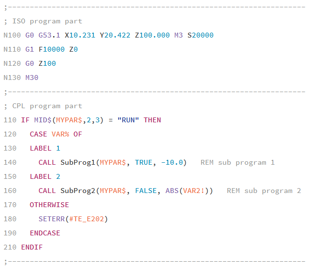

# [CNC BoschRexroth MTX language support][home]
[](LICENSE)
[](https://packagecontrol.io/packages/CNC BoschRexroth MTX)

This package provides syntax highlighting support for the
[BoschRexroth MTX][4] Computerized Numerical Control to the [SublimeText 3 Editor][1].

## Screenshot:


## Features:

* NC cycles
  * syntax highlighting
    * ISO G-Code
    * CPL high level commands
    * known NC functions and commands
  * symbols for
    * LPS - local sub programs
    * LBL - labels (goto targets)
    * auto completion for the most common DIN/CPL functions

* Sercos Settings Files (*.scs)
  * syntax highlighting

## Installing


### Using [Package Control][2]

For all Sublime Text 2/3 users install via [Package Control][2] is recommended.

1. [Install][3] Package Control if you haven't yet.
2. Use <kbd>ctrl</kbd>+<kbd>shift</kbd>+<kbd>P</kbd> then `Package Control: Install Package`
3. Look for `CNC BoschRexroth MTX` and install it.


### Manual Install

1. Click the `Preferences > Browse Packages…` menu
2. Browse up a folder and then into the `Installed Packages/` folder
3. Download [zip package][zip] rename it to `CNC BoschRexroth MTX.sublime-package` and copy it into the `Installed Packages/` directory
4. Restart Sublime Text


## Setup

If ``mtx_npg.sublime-settings`` or ``mtx_scs.sublime-settings`` don't exist in the user folder they will be automatically created to ensure the following essential syntax specific settings:

```javascript
{
  "ensure_newline_at_eof_on_save": true
  "translate_tabs_to_spaces": true
  "use_tab_stops": false
}
```

They are all required to ensure NC will read the resulting file correctly.
You can override these settings by creating your own syntax specific setting ``Preferences->Settings - Syntax Specific``

## License
The code is available at [GitHub][home] under [MIT licence][lic].

[home]: <https://github.com/deathaxe/sublime-mtx>
[lic]:  <https://github.com/deathaxe/sublime-mtx/blob/master/LICENSE>
[zip]:  <https://github.com/deathaxe/sublime-mtx/archive/master.zip>
[1]:    <http://www.sublimetext.com>
[2]:    <https://packagecontrol.io>
[3]:    <https://packagecontrol.io/installation>
[4]:    <https://www.boschrexroth.com/en/xc/products/product-groups/electric-drives-and-controls/cnc/indramotion-mtx/indramotion-mtx>
